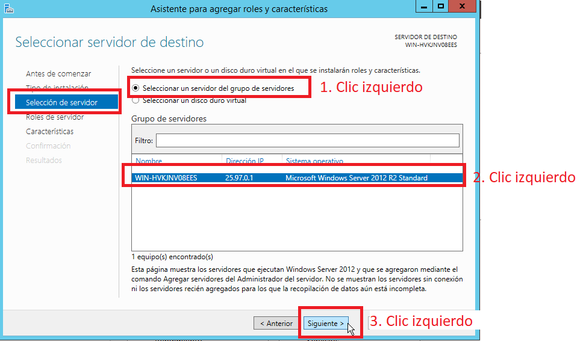
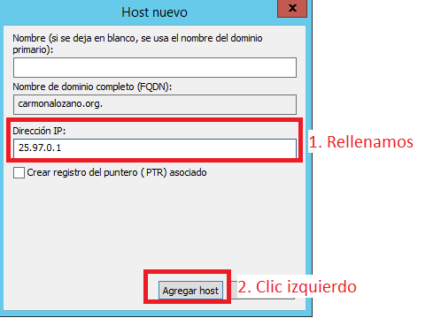

# EXAMEN DE SERVICIOS DE RED E INTERNET

>SERVIDOR UBUNTU versión 12, debe ser servidor DHCP Y DNS con soporte pxe. Su dirección Ip es 25.xx.0.1 donde xx son las dos últimas cifras del dni de cada uno.

### Requisitos

- Windows 2012 Server R2
  - Servidor DHCP
  - Servidor DNS
  - Cliente TFTP
- UbuntuServer 18.04
  - Paquete openssh-server
  - Paquete isc-dhcp-server
  - Paquete bind9
  - Paquete tftp-hpa

- Configuración del servidor **DHCP:**
  - Configuración DHCP
  - Rango: 25.xx.0.10-25.xx.0.120
  - Máscara de subred: 255.255.255.0
  - Puerta de enlace y DNS: 25.xx.0.1

- Configuración del servidor **DNS:**
    - **`dominio.org`** donde dominio será los apellidos de cada uno. Ejemplo:  **``carrascoromero.org``**
    - En el fichero de nombres local aparecerán los nombres: dns asociado a 25.xx.0.1, www,smtp, pop y pop3 asociados a 25.xx.0.2.
    - El servidor es maestro de su zona o dominio y caché forwarding del resto.
- Configuración tftp
    - disponemos de la imagen netboot.tar.gz


 [Configuracion en Windows Server(solo DHCP y DNS)](#configuraci%c3%b3n-en-windos-server)


### Configuración en Windos server

### Indice

- [EXAMEN DE SERVICIOS DE RED E INTERNET](#examen-de-servicios-de-red-e-internet)
    - [Requisitos](#requisitos)
    - [Configuración en Windos server](#configuraci%c3%b3n-en-windos-server)
    - [Indice](#indice)
    - [Configuración DHCP](#configuraci%c3%b3n-dhcp)
    - [Configuración DNS](#configuraci%c3%b3n-dns)
      - [Configuración de zona directa](#configuraci%c3%b3n-de-zona-directa)
      - [Configuración de zona inversa](#configuraci%c3%b3n-de-zona-inversa)
    - [Comprobacion Windows Server DNS y DHCP](#comprobacion-windows-server-dns-y-dhcp)

Nada mas tener la maquina instalada, voy a configurarla tarjeta de red en **Red Interna** y le voy a configurar la **direccion ip, mascara, etc.**

Abajo a la derecha en Vbox damos **Clic Derecho** sobre el icono de las dos pantallas, se abrirá un desplegable seleccionamos **Preferencias de red...**, se abrirá una ventana nueva y dentro nos vamos al centro donde dice **Conectado a: NAT**, seleccionamos **NAT** y en el desplegable que se nos abre pinchamos sobre **Red Interna** y por ultimo le damos a aceptar.


Ahora voy a configurar la tarjeta de red en **Windows**, damos **Clic Derecho** en el botón que se encuentra abajo a la derecha justo a la izquierda del **Volumen de Windows** y en el desplegable le damos a **Abrir Centro de redes y recusos compartidos**, en la ventana que se abre, arriba a la izquierda hacemos clic sobre **Cambiar configuración del adaptador**.


Se nos abrirá otra ventana mas, dentro le damos **Clic derecho** sobre la Interfaz de red que dice **Ethernet** y seleccionamos **Propiedades**, se nos abrirá una ventana más, dentro de ella en el centro donde dice **Esta conexión usa los siguiente elementos:**, seleccionamos de la lista **Protocolo de Internet versión 4(TCP/IPv4)** y justo debajo le damos a **Propiedades**


En la ventana que se abre le damos a opción que dice **Usar la siguiente dirección IP** y rellenamos los campos con nuestros datos en mi caso sería así:

```
Dirección IP: 25.97.0.1
Máscara de subred: 255.255.255.0
Puerta de enlace predeterminada: 25.0.0.1

Servidor DNS preferido: 25.97.0.1
Servidor DNS alternativo: 127.0.0.1
```

Resultado:


Aceptamos y cerramos todas las ventanas.


Ahora voy a instalar los servidores de **DNS** y **DHCP**, para eso entramos en el **Administrador del Servidor** que se encuentra justo a la derecha del **Icono de Windows** en la parte **inferior izquierda**. Dentro del **Administrador del Servidor**, nos vamos a la parte de arriba a la derecha en **Administrar** y en el desplegable seleccionamos la opción **Agregar roles y características** .


Se abrirá una ventana nueva con asistente de instalación, **en la parte de la izquierda** veremos porque paso vamos y a la derecha toda la información necesaria par instalar los servidores. En la primera ventana que dice **Antes de comenzar no tocamos nada y le damos a siguiente**

<details>
<summary>Imagen de la ventana 1</summary>


</details>

En la siguiente ventana llamada Tipo de instalación  seleccionamo a la derecha la opción que dice **Instalación basada en características o en roles** y le damos a siguiente.

<details>
<summary>Imagen de la ventana 2</summary>


</details>

En la siguiente ventana llamada **Selección de servidor**, lo unico que tenemos que hacer es asegurarnos es que está seleccionado el servidor donde vamos a instalar el servicio de **DNS y DHCP** y le damos a siguiente.

<details>
<summary>Imagen de la ventana 3</summary>


</details>

En la siguiente ventana llamada **Roles de servidor** es donde vamos a seleccionar la instalación del servidor DNS y DHCP, bajamos un poco a la derecha donde dice **Roles** y buscamos **Servidor DHCP y Servidor DNS** y los marcamos marcamos los dos.

> Cuando marcamos los servidores saldrá una ventana emergente que nos dirá si queremos agregar esa característica, nos aseguramos que está el **tick** puesto en la opción **Incluir herramientas de administración** y le damos a agregar características

<details>
<summary>Imagen de la ventana 4</summary>


</details>

En la siguiente ventana llamada **Características** seleccionamos como antes el **Cliente TFTP** y le damos a siguiente

<details>
<summary>Imagen de la ventana 5</summary>


</details>

Las siguientes ventanas es ir dandole a siguiente hasta llegar a la ventana de **Confirmación** donde nos saldrá la opción de **Instalar** le damos y listo se instalan los servidores.

Una vez instalados los servicios de **DNS** y **DHCP** vamos a pasar a configurarlos:


### Configuración DHCP
Con el servidor DHCP instalado volvemos al **Administrador del servidor**, arriba a la derecha le damos a **Herramientas** y en el desplegable pinchamos en **DHCP**.


En la ventana que se abre a la izquierda saldrá como una **Vista en Arbol**, seleccionamos el servidor y lo abrimos, justo debajo aparecerá la opcion de **IPv4** la seleccionamos y clic derecho, en el desplegable nos vamos a **Ambito nuevo...**


Al darle se nos abrirá un asistente, la primera ventana del asistente es informativa, así que le damos a siguiente.

En la siguiente ventana nos pedirá un nombre para el ámbito y un descripción los rellenamos y le damos a siguiente.


En la siguiente ventana nos pide que introduzcamos el **rango de direcciones IP** y la mascará, lo rellenamos y le damos a siguiente:

- Datos introducidos
```
Dirección ip inicial: 25.97.0.10
Dirección ip final: 25.97.0.120
Máscara de subred: 255.255.255.0
```

Resultado:


La siguiente ventana es de **exclusiones**, no la tocamos y seguimos adelante. La siguiente ventana a la de **exclusiones**, es la **duración de la concesión**, no la tocamos y seguimos dandole a siguiente.

La siguiente ventana a la de **duración de concesión** es para configurar la puerta de enlace y el DNS asi que dejamos marcada la primera opción la cual direc **Configurar estas opciones ahora** y le damos a siguiente.


En puerta de enlace predeterminada introducimos la que pusimos en nuestra configuración de la tarjeta de red en mi caso '25.97.0.1'.


En la siguiente ventana a la del enrutador se nos preguntará sobre la resolucion de nombre o DNS, rellenamos poniendo **``apellidos.org``**, en mi caso seria: **``carmonalozano.org``** y le damos a siguiente.


Activamos el ambito y le damos a siguiente.


Con esto estaría el servidor DHCP configurado. Ya solo faltaria configurar el servidor DNS.
### Configuración DNS

Para configurar el servidor **DNS** volvemos al **Administrador del servidor**, arriba a la derecha le damos a **Herramientas** y en el desplegable pinchamos en **DNS**.


Se nos abrirá una ventana donde nos saldrá lo mismo que el servidor DHCP una **Vista en Arbol**, abrimos nuestro servidor DNS y nos saldrán varias carpetas, dos de ellas llamadas **Zonas de busqueda directa** y **Zonas de busqueda inversa**.

> Voy a dividir esta configuración en dos, configuración de Zona directa y Configuración de zona inversa.

#### Configuración de zona directa
Empezamos configurando la **Zona Directa** haciendo clic derecho en la carpeta que pone **Zonas de busqueda directa** y en el desplegable en **Zona nueva...**


Se nos abrirá en una ventana nueva el asistente de configuración el **Asistente de configuración de zona nueva** la primera ventana la saltamos dandole a siguiente.

En la siguiente ventana nos saldrá **Tipo de Zona**, seleccionamos la primera opción que dice **Zona Principal** y le damos a siguiente.


En la siguiente ventana introducimos el nombre de la zona que se llamará como nuestro **`apellido.org`** en mi caso **``carmonalozano.org``** y le damos a siguiente.


Los demás es irle dando a siguiente hasta finalizar. Al finalizar nos creará una carpeta con nuestro nombre de dominio dentro de la carpeta llamada **Zonas de busqueda directa**, hacemos clic derecho sobre ella y le damos a **Host nuevo(A o AAA)...**


En la ventan que se abré la primera opción que es el nombre lo dejamos en blanco y nos vamos a la ultima opción que dice **Dirección IP:** e introducimos la nuestra y le damos a **Agregar host**.



Ahora voy a crear los 4 hosts llamados **www, smtp, pop y pop3** y les voy a asociar la direccion ip **25.97.0.2**. Para hacer esto repito el paso anterior y en el nombre añado www, smtp, pop o pop3 y le asigno la direccion ip.


Al acabar esto deberian haber unos 5 archivos de hosts con sus nombres y direcciones ip.


Ahora solo faltaria configurar la zona inversa
#### Configuración de zona inversa

Para configurar la zona inversa nos vamos a la izquierda en el arbol y hacemos clic derecho sobre la carpeta llamada **Zonas de busqueda inversa** y en **Zona nueva...** en el desplegable.


Se nos abrirá nuevamente un asistente de configuración le damos a siguiente en la primera ventana. Seleccionamos de nuevo **Zona Principal** y le damos a siguiente.


En esta ventana llamada **Nombre de la zona de busqueda inversa**, seleccionamos la primera opción que dice **Zona de busqueda inversa para IPv4** y le damos a siguiente.


Al darle a siguiente nos pedirá el **Id. de red:**, son las tres primeras partes de nuestra dirección ip, lo rellenamos y le damos a siguiente.


Ya solo queda ir dandole a siguiente hasta finalizar la configuración, y al finalizar al igual que con la zona directa nos creará una carpeta con el nombre de **`0.97.25.in-addr.arpa`**, le damos clic derecho y le damos a **Nuevo puntero(PTR)...**


En la ventana emergente que se nos abre vamos directamente a **Examinar...** y en la proxima ventana que se nos abre vamos haciendo doble clic hasta llegar a los **archivos de hosts**, seleccionamos el que no tiene nombre y le damos a **Aceptar**, **repetimos el proceso para todos los archivos de host**


Al añadir todos los hosts deberiamos de tener algo parecido a esto:


Ya solo queda reiniciar los dos servidores y comprobar que funciona para hacerlo entramos en el **Administrador del servidor** de nuevo y a la izquierda nos saldrá **DNS** y **DHCP**, entramos en cada uno y bajamos hasta el apartado de **SERVICIOS** le damos clic derecho en el servicio que está dentro y reiniciamos.


### Comprobacion Windows Server DNS y DHCP

Para comprobar que todo a funcionado y que los servidores están funcionando abrimos un CMD y ejecutamos el comando **nslookup**:

