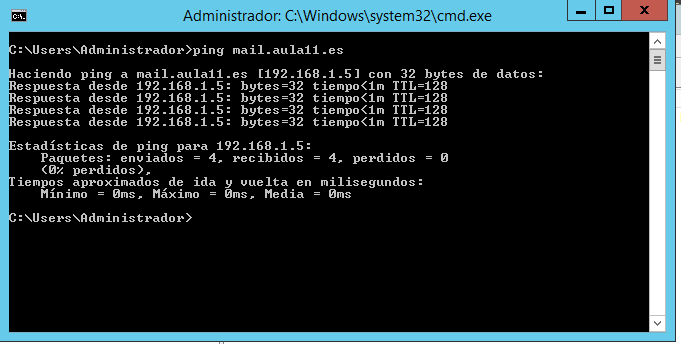
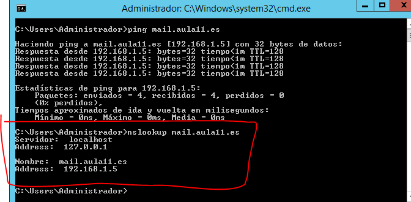
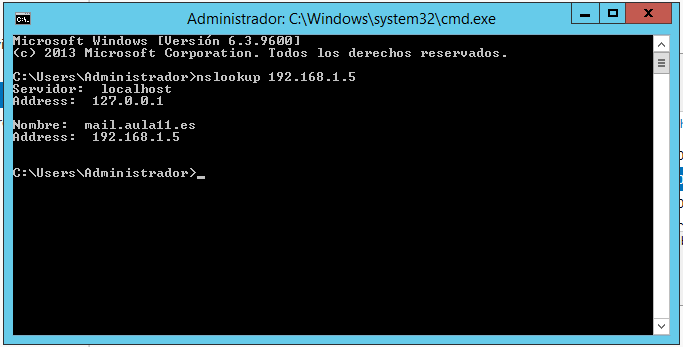

# DNS-SERVER-CONFIG

## Indice
> Antes de empezar me gustaria añadir que este servidor va estar funcionando junto con la configuración de otro [servidor DHCP que ya deberia estar configurado](https://github.com/Chirili/DHCP-SERVER-CONFIG)

- [Requisitos]()
- [Instalación y configuración del servidor **DNS** en windows](#-Instalación-y-configuración-del-servidor-DNS-en-windows)
- [Instalación y configuración del servidor DNS en ubuntu(bind9)](#Instalación-y-configuración-del-servidor-DNS-en-ubuntu(bind9))

## Requisitos

- Virtual Box
- Ubuntu server 18.04
- Windows server 2012 R2

### Instalación y configuración del servidor DNS en windows
#### Agregar servicio DNS a Windows
Para instalar el servidor **DNS** en windows tenemos que irnos a la **Administración del servidor** y arriba a la derecha clicamos en **Administrar > Agregar roles y características.**

- Se nos abrira una vetana emergente, en la ventana le vamos dando a siguiente hasta que lleguemos a los **Roles del Servidor:**


- Buscamos el la opción de **Servidor DNS** y la marcamos. En la ventana emergente le damos a **Agregar Características**

- Una vez marcado el **Servidor DNS**, le damos a siguiente hasta que nos salga la opción de **Instalar**.

Conforme esté instalado el servidor volvemos a la **Administración del Servidor**, esta vez arriba a la derecha en **Herramientas** buscamos **DNS:**


Se nos abrirá una ventana emergente en la que nos saldrá **DNS>Wind...** que es el nombre de nuestro equipo, lo abrimos y saldrán varias carpetas **Zonas de búsqueda directa** y **Zonas de búsqueda inversa**

Vamos a hacer clic derecho en **Zonas de búsqueda directa** y en zona nueva:


Le damos a siguiente y nos saldrá el **Tipo de zona**, seleccionamos la **Zona principal** y le damos a siguiente.

Al darle a siguiente estaremos en la pantalla para seleccionar el **Nombre de la zona**, en mi caso le asignaré **`aula11.es`**, despues de seleccionar el nombre le vamos a dando a siguiente hasta finalizar, cuando acabe nos saldrá una carpeta con el nombre elegido de la zona, en mi caso **`aula11.es`.**


Entramos en la carpeta esa y saldrán dos archivos y hacemos clic derecho en la zona black del centro y nos vamos al opción **Host nuevo (A o AAAA)...**


Al darle se nos abrirá una ventana emergente de configuraciónen la que nos pedirá un **Nombre** y una **dirección IP**, en el nombre podemos poner **mail** como ejemplo y la direccion DNS quedaria así: **`mail.aula11.es`** en mi caso. Una vez introducidos los datos le damos a **Agregar host.**


Si todo va bien no saltará una ventana emergente diciendo que el host se ha agregado.

Antes de continuar vamos a comprobar que ha funciona lo que hemos hecho.

Abrimos el CMD y escribimos los siguientes comandos:

```bash
ping vuestroDominio(en mi caso es mail.aula11.es)
```

Resultado: 



Y el siguiente comando para ver que de verdad funciona es el nslookup:

```bash
nslookup mail.aula11.es
```

Resultado:



Pero ahora hay un problema si hacemos el nslookup a la direccion ip no funciona, asi que ahora toca configurar la zona inversa, para hacer esto volvemos a la configuración del DNS

Y hacemos clic derecho en **Zonas de busqueda inversa** y **Zona nueva...**, se nos abrirá de nuevo el asistente de configuración, le damos a siguiente, a **Zona principal** de nuevo y siguiente.

En esta pestaña dejamos marcada la primera opción **Zona de búsqueda inversa para IPv4** y siguiente


Al darle a siguiente nos pedirá una **Id. de red** aquí lo que tenemos que poner son las 3 primeras porciones de la direccion IP que le hemos asignado al servidor, en mi caso tengo la **192.168.1.5**, entonces tendría que poner la **192.168.1**, si teneis la direccion ip 192.168.61.100, pues tendríais que poner en el **Id. de red** lo siguiente: **192.168.61**, ya solo faltaría ir dandole a siguiente hasta finalizar la cofiguración


Conforme acabe la configuración entramos en la carpeta que se habrá creado y la cual contendrá 2 arhivos, le damos click derecho en el centro y elegimos la opción **Nuevo puntero(PTR)...**


A elegir esa opción se nos abrirá una ventanita llamada **Nuevo registro de recursos**, vamos a ir **Nombre de host** y a **Examinar...**, y se nos abrirá como un explorador de archivos, lo primero que saldrá es el **nombre del servidor**, entramos en el y luego aparecerá la carpeta **Zonas de búsqueda directa**, entramos en ella y saldrá el **nombre de nuestra zona** y dentro de ella el **host** que creamos, lo seleccionamos y aceptamos. Ahora vamos a probar que funciona:

- Abrimos el CMD y ejecutamos el nslookup sobre la direccion ip asignada al servidor:

Resultado:



> Antes de realizar las pruebas teneis que configurar la tarjeta de red en ubuntu de la siguiente manera.


> No hay que decir que las direcciones IP en **nameservers** las teneis que sustituir por la de vuestro servidor DNS

Ahora lo voy a enseñar desde el **cliente ubuntu server:**


En la imagen se ve como el comando **ifconfig** muestra como el servidor **DHCP** configurado está funcionando y como el comando nslookup devuelve de manerá correcta los valores.


### Instalación y configuración del servidor DNS en ubuntu(bind9)