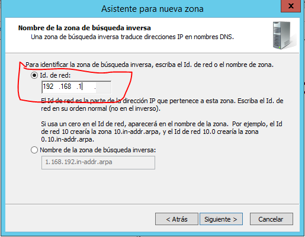

# DNS-SERVER-CONFIG

## Indice
> Antes de empezar me gustaria añadir que este servidor va estar funcionando junto con la configuración de otro [servidor DHCP que ya deberia estar configurado](https://github.com/Chirili/DHCP-SERVER-CONFIG)

- [Requisitos]()
- [Instalación y configuración del servidor DNS en windows](#-Instalación-y-configuración-del-servidor-DNS-en-windows)
- [Instalación y configuración del servidor DNS en ubuntu(bind9)](#Instalación-y-configuración-del-servidor-DNS-en-ubuntu(bind9))

## Requisitos

- Virtual Box
- Ubuntu server 18.04
- Windows server 2012 R2

### Instalación y configuración del servidor DNS en windows
#### Agregar servicio DNS a Windows
Para instalar el servidor **DNS** en windows tenemos que irnos a la **Administración del servidor** y arriba a la derecha clicamos en **Administrar > Agregar roles y características.**

- Se nos abrira una vetana emergente, en la ventana le vamos dando a siguiente hasta que lleguemos a los **Roles del Servidor:**


- Buscamos el la opción de **Servidor DNS** y la marcamos. En la ventana emergente le damos a **Agregar Características**

- Una vez marcado el **Servidor DNS**, le damos a siguiente hasta que nos salga la opción de **Instalar**.

Conforme esté instalado el servidor volvemos a la **Administración del Servidor**, esta vez arriba a la derecha en **Herramientas** buscamos **DNS:**


Se nos abrirá una ventana emergente en la que nos saldrá **DNS>Wind...** que es el nombre de nuestro equipo, lo abrimos y saldrán varias carpetas **Zonas de búsqueda directa** y **Zonas de búsqueda inversa**

Vamos a hacer clic derecho en **Zonas de búsqueda directa** y en zona nueva:


Le damos a siguiente y nos saldrá el **Tipo de zona**, seleccionamos la **Zona principal** y le damos a siguiente.

Al darle a siguiente estaremos en la pantalla para seleccionar el **Nombre de la zona**, en mi caso le asignaré **`aula11.es`**, despues de seleccionar el nombre le vamos a dando a siguiente hasta finalizar, cuando acabe nos saldrá una carpeta con el nombre elegido de la zona, en mi caso **`aula11.es`.**


Entramos en la carpeta esa y saldrán dos archivos y hacemos clic derecho en la zona blanca del centro y nos vamos al opción **Host nuevo (A o AAAA)...**


Al darle se nos abrirá una ventana emergente de configuraciónen la que nos pedirá un **Nombre** y una **dirección IP**, en el nombre no vamos a poner nada y la direccion IP vamos a poner la que tiene nuestro servidor. Una vez introducidos los datos le damos a **Agregar host.**


**Yo he pues la direccion ip 192.168.1.3, porque es la que tengo asignada ahora mismo a mi servidor, ustedes poneis la vuestra**

Si todo va bien no saltará una ventana emergente diciendo que el host se ha agregado.

Despues de añadir ese host vamos a añadir unos cuantos hosts mas y con distintas direcciones ip:
    - **`dns.aula11.es`**: este va tener la direccion ip del servidor tambien.
    - **`web.aula11.es`**: este host va ser de tipo **A o AAAA** y va tener la direccion de nuestro servidor web, para despues asignarle el alias de **www**, **yo en la direccion ip le voy a asignar la 192.168.1.6 aunque no exista**. Después los explico todo.
    - **`www.aula11.es`**: este va ser de tipo **CNAME** por si queremos tener nuestra pagina web.
> Para agregar un host de tipo **CNAME** vamos a hacer lo mismo que antes, clic derecho en la zona blanca y saldrá la opción de **Alias nuevo(CNAME)...**


Esto es facil ponemos el **Nombre de alias** que es **www** y **Nombre de dominio completo (FQDN) para el host de destino:**, le damos a **Examinar...** y vamos accediendo hasta llegar a la carpeta de nuestro dominio **``aula11.es``** en mi caso, dentro habrá varios archivos que son los hosts que hemos creado anteriormente, le damos en el de **web** que en mi caso tiene la dirección ip **192.168.1.6** y aceptamos.

Hasta este punto deberiamos de tener unos ** 3 achivos de tipo host A** y uno de tipo **CNAME**, es decir, de alias:


Vamos a agregar el servidor de correos ya que estamos, agregamos un nuevo host de tipo **A** y le ponemos de nombre **mail** y de dirección ip pues la que tenga nuestro servidor de correos, como no tengo un servidor de correos puesto pues me invento la direccion ip por ejemplo la: **192.168.1.10**.

Y luego vamos a crear el host de tipo **MX**, **Host o dominio secundario**, en blanco y lo que nos interesa es **Nombre de dominio completo(FQDN)...:**, ahi que darle a **Examinar...** y seleccionar el archivo de **mail** con la **direccion ip correspondiente**, o sin entrar a examinar lo escribimos: **`mail.aula11.es`** en mi caso.


Por ultimo podemos crear dos hosts de prueba, por si tenemos mas maquinas, el primero se va llamar **``WindowsCliente1``** y el otro **`UbuntuCliente1`**. Cada uno con una direccion ip que me he inventado a uno le he puesto la **1.16** y al otro la **1.15**, la zona directa deberia de quedar mas o menos así:


Antes de continuar y configurar la zona inversa vamos a comprobar que ha funcionado lo que hemos hecho.

Abrimos el CMD y primero vamos a probar el ping primero:
Resultado: 


Os pongo en contexto, mi servidor tiene la dirección ip estática **192.168.1.3** en la imagen se ve como los dos primeros pings funcionan y los otros dos no, esto es porque los dos primeros ping se los hago a los hosts que tienen la direccion ip **192.168.1.3** que se ven a la izquierda.

Entonces si intento hacer un ping a una direccion ip, que no tiene un equipo o un servicio que conteste, saldrá **host de destino no accesible**

Ahora vamos a probar el comando nslookup con los ejemplos anteoriores y añadiré mas:

Resultado:


**Saldra servidor: Unkown** no os preocupeis por esto, sale eso porque no tenemos configurada todavia la zona inversa, en cuanto la configuremos saldrá nuestro dominio. En la imagen se ve a la derecha el comando **nslookup** y a la izquierda las llamadas a cada archivo y como en el comando nslookup tienen las direcciones IP asignadas a cada archivo.

Pero ahora hay un problema si hacemos el nslookup a la direccion ip no funciona, asi que ahora toca configurar la zona inversa, para hacer esto volvemos a la configuración del DNS

Y hacemos clic derecho en **Zonas de busqueda inversa** y **Zona nueva...**, se nos abrirá de nuevo el asistente de configuración, le damos a siguiente, a **Zona principal** de nuevo y siguiente.

En esta pestaña dejamos marcada la primera opción **Zona de búsqueda inversa para IPv4** y siguiente


Al darle a siguiente nos pedirá una **Id. de red** aquí lo que tenemos que poner son las 3 primeras porciones de la direccion IP que le hemos asignado al servidor, en mi caso tengo la **192.168.1.3**, entonces tendría que poner la **192.168.1**, si teneis la direccion ip **192.168.61.100**, pues tendríais que poner en el **Id. de red** lo siguiente: **192.168.61**, ya solo faltaría ir dandole a siguiente hasta finalizar la cofiguración



Conforme acabe la configuración entramos en la carpeta que se habrá creado y la cual contendrá 2 arhivos, le damos click derecho en el centro y elegimos la opción **Nuevo puntero(PTR)...**


A elegir esa opción se nos abrirá una ventanita llamada **Nuevo registro de recursos**, vamos a ir **Nombre de host** y a **Examinar...**, y se nos abrirá como un explorador de archivos, lo primero que saldrá es el **nombre del servidor**, entramos en el y luego aparecerá la carpeta **Zonas de búsqueda directa**, entramos en ella y saldrá el **nombre de nuestra zona** y dentro de ella estarán todos los **hosts** que creamos, lo seleccionamos y aceptamos.

> Tenemos que crear un puntero **PTR** por cada host que tenemos configurado en la zona directa, si habeis seguido mis pasos deberiais de tener **unos 6 punteros PTR**


Antes de comprobar que funciona esto, vamos a reiniciar el servidor **DNS** en el **Administrador de Servidores**


- Abrimos el CMD y ejecutamos el nslookup sobre la direccion ip asignada al servidor:

Resultado:


En la imagen se ve que funcionan todas las direccion con nslookup.

> Antes de realizar las pruebas teneis que configurar la tarjeta de red en ubuntu de la siguiente manera.


> No hay que decir que las direcciones IP en **nameservers** las teneis que sustituir por la de vuestro servidor DNS

Ahora lo voy a enseñar desde el **cliente ubuntu server:**


En la imagen se ve como el comando **ifconfig** muestra como el servidor **DHCP** configurado está funcionando y como el comando nslookup devuelve de manerá correcta los valores.

### Instalación y configuración del servidor DNS en ubuntu(bind9)

Para instalar **bind9** vamos a usar el siguiente comando:

```bash
apt update && apt upgrade && apt install bind9
```

Antes de nada nos vamos a mover a la carpeta donde se encuentra instalado bind9 con el comando: **`cd /etc/bind`**

Lo siguiente que vamos a hacer es configura nuestra zona, para eso vamos a editar el archivo **named.conf.local**, con el siguiente comando: **`nano named.conf.local`** y vamos a añadir lo siguiente al archivo:

```bash
zone "aula11.es" {
    type master;
    file "/etc/bind/zones/db.aula11.es";
}
zone "1.168.192.in-addr.arpa"{
    type master;
    file "/etc/bind/zones/db.192";
}
```

Explicación de las configuraciones:

- **Zona directa:**
    - Para empezar el nombre de **aula11.es** lo podeis modificar a vuestro gusto, mas tarde dentor de otro archivos configuramos mas a fondo los nombres por ejemplo **dns.aula11.es**.
    - El **type master**, es el tipo de **zona Maestra o Principal** del servidor **DNS**, después de esta se pueden tener zonas esclavas con **type slave**, pero como solo vamos a tener una zona lo dejamos tal cuál.
    - El **file** contiene la ruta y el nombre del archivo de configuración de dicha zona.
- **Zona inversa:**
    - El nombre de la zona tiene que ser vuestra dirección ip de manera inversa mas el **`.in-addr.arpa`**, ej: tengo la direccion ip **192.168.54.20**, pues la zona se llamaria **`54.168.192.in-addr.arpa`**
    - El tipo es igual que el de la zona directa.
    - El file es lo mismo tambien que la zona directa.

Cualquier coma mal puesta o falta de ortografia puede causar algun error en el servidor DNS, si quereis comprobar si hay algun error en la configuración del archivo solo teneis que ejecutar el siguiente comando: **`named-checkconf + archivo`**


- Una vez hecho configurado y comprobado que todo está bien vamos a crear una carpeta que es la que va a almacenar los archivos de configuración de las zonas con **`mkdir zones`**.

Ahora vamos a copiar los archivos de configuración por defecto de bind9 a esa carpeta con el siguiente comando: **`cp db.local zones/db.aula11.es`** y **`cp db.127 zones/db.192`** el nombre de los archivos los podeis modificar a vuestro gusto, ahora vamos a configurarlos.

Empezando por el archivo **`db.aula11.es`** **`nano zones/db.aula11.es`** añadimos al archivo los siguiente:


Voy a añadir unas lineas mas para que veamos como funciona esto:


Luego vamos al archivo **`db.192`** **`nano zones/db.192`** y añadimos los siguiente:


Como se puede ver los archivos de configuración de bind9 se componen de varios tipos de registro el primero de tipo **NS** que es el **Name Server**(Nombre del servidor), luego estan los registros de tipo **A**, que es un registro de host que se vincula un dominio con la direccion IP fisica de un ordenador, existen mas tipos de registros:
- **MX:** dirigen el correo electrónico de un dominio a los servidores que alojan las cuentas del usuario del dominio.
- **TXT:** proporcionan información de texto a fuentes externas a tu dominio y se puede utilizar con distintos fines.
- **CNAME:** enlazan un nombre de alias con otro nombre de dominio canónico o auténtico por ejemplo **www.example.com.**

Despues de esta chapa vamos a comprobar que hemos configurado bien los dos archivos, entramos en la carpeta **`zones`** y ejecutamos los siguientes comandos:

- Zona directa:
```bash
named-checkzone aula11.es db.aula11.es
```

Si todo va bien deberia de mostrar lo siguiente:


- Zona inversa:
```
named-checkzone 1.168.192.in-addr.arpa db.192
```

Y reiniciamos el servicio de bind9:

```bash
service bind9 restart
```

Y luego miramos el estado a ver si está funcionando:

```bash
service bind9 status
```

Y debería de volver algo parecido a esto:


Despues para comprobar que funciona podemos usar estos comandos:

- nslookup:
    - **`nslookup aula11.es`**
- dig:
    - **`dig aula11.es`**

Comprobación de las zonas:

